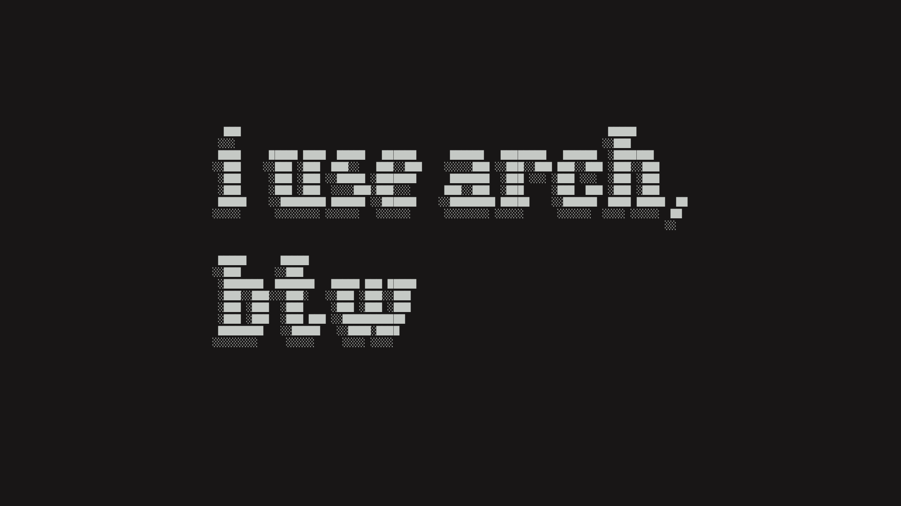

# asciitextwall

Generate ascii text wallpapers using the `pyfiglet` and `pillow` Python libraries to:

- Create a colored background with custom resolution
- Generate ascii art text
- Append said text to the center of the background

## Usage

You can run `main.py` with the `-h`/`--help` argument to see all the options:

```
usage: asciitextwall [-h] -t TEXT -f FONT -mf MONO_FONT -s SIZE [-w WIDTH] -c COLOR -b BG_COLOR -iw IMG_WIDTH -ih IMG_HEIGHT [-p]

Simple tool to generate ascii text wallpapers

options:
  -h, --help            show this help message and exit
  -t, --text TEXT       Text to display
  -f, --font FONT       Pyfiglet font to use
  -mf, --mono_font MONO_FONT
                        Monospaced font to use
  -s, --size SIZE       Size of the text
  -w, --width WIDTH     Width of the text. 80 by default
  -c, --color COLOR     Color of the text
  -b, --bg_color BG_COLOR
                        Color of the background
  -iw, --img_width IMG_WIDTH
                        Output image width
  -ih, --img_height IMG_HEIGHT
                        Output image height
  -p, --preview         Preview the image output without writing it
```

## Preview pyfiglet fonts

I have included a tiny script to generate a text file with an example using all the fonts included in pyfiglet. [Check it here](test/test_fonts.py)

## Examples

> [!NOTE]
> In this examples I use `uv` to run the script in a virtual enviroment

- Using kanagawa dragon colors

  ```
  uv run main.py -t "i use arch, btw" -f "dos_rebel" -mf "/usr/share/fonts/TTF/MesloLGMNerdFont-Regular.ttf" -s 20 -w 100 -c "#c5c9c5" -b "#181616" -iw 1920 -ih 1080
  ```

  

- Using tokyonight dark colors

  ```
  uv run main.py -t "qwrty" -f "bloody" -mf "/usr/share/fonts/noto/NotoSansMono-Regular.ttf" -s 40 -w 100 -c "#a9b1dc" -b "#1a1b2c" -iw 1920 -ih 1080
  ```

  

- Using grubvox dark colors

  ```
  uv run main.py -t "testing" -f "delta_corps_priest_1" -mf "/usr/share/fonts/TTF/DejaVuSansMono.ttf" -s 20 -w 100 -c "#ebdbb2" -b "#282828" -iw 1920 -ih 1080
  ```

  
